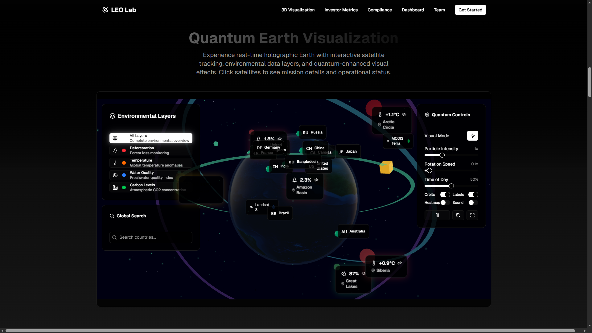
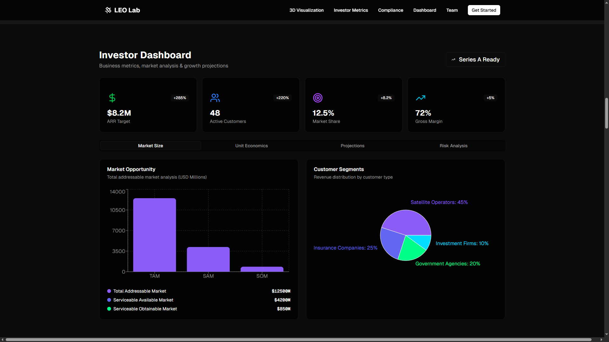
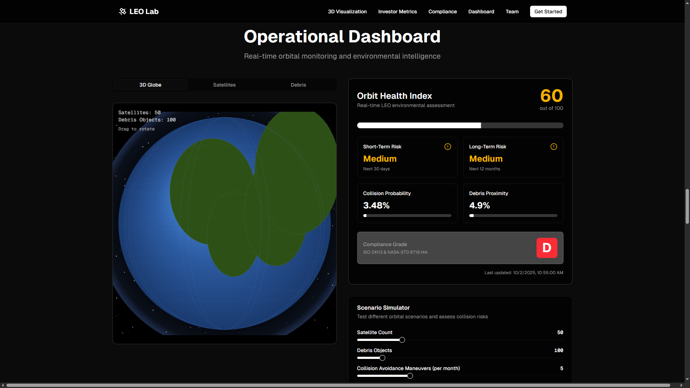

# 🌍🚀 LEO Environmental Lab  

**An integrated digital platform that transforms real-time NASA data and satellite feeds into community-ready environmental intelligence.**  

LEO Environmental Lab acts as a bridge between **space commercialization** and **Earth’s sustainability** by providing tools for orbital safety, debris mitigation, climate monitoring, and ESG accountability for satellites.  

Through **advanced 3D visualizations**, **sustainability dashboards**, **AI-driven anomaly detection**, and **localized alerts**, our platform empowers policymakers, researchers, educators, businesses, and communities to engage with space data in meaningful and actionable ways.  

---

## 📌 Project Summary  

The **LEO Environmental Lab** democratizes access to space intelligence. By merging **NASA’s open APIs**, **AI-driven analytics**, and **sustainability frameworks**, the project not only safeguards Earth’s orbit but also strengthens resilience against climate change.  

---

## 🛰️ Project Details  

### 🔹 Why?  
Space commercialization is accelerating, but without safeguards, **orbital congestion** and **debris accumulation** may jeopardize future missions. Simultaneously, the **climate crisis** demands innovative solutions that connect space activities with environmental resilience on Earth.  

### 🔹 What?  
A comprehensive **environmental intelligence lab** uniting:  
- NASA open data  
- AI-driven analysis  
- Sustainability frameworks  

### 🔹 How?  
Our platform combines **real-time NASA satellite feeds**, **ground sensors**, and **climate APIs** to deliver actionable insights.  

Features include:  
- 🌍 **3D Orbital Health Monitoring** with collision probability alerts  
- 📊 **Climate Analytics Dashboard** (natural disasters, emissions, deforestation)  
- ♻️ **Sustainability Ledger & ESG Dashboard** with lifecycle tracking and carbon credit verification  
- 🔔 **Localized Alerts** for communities, educators, and policymakers  

---

## 🧩 Technical Brief  

The LEO Environmental Lab is built as a **modular, scalable system** optimized for real-time space and climate data visualization.  

### 🔹 System Architecture  
- **Frontend Layer (UI/UX):**  
  - Built with **React + Next.js** for SSR and routing.  
  - **Three.js** powers interactive 3D Earth and orbital visualizations.  
  - **Recharts** provides analytical climate dashboards.  
  - Styled with **TailwindCSS** for responsive, dark-themed UI.  

- **Integration & API Layer:**  
  - **TypeScript + Node.js** handle NASA API calls and data preprocessing.  
  - NASA APIs integrated:  
    - **EONET** – Natural events (wildfires, storms, floods)  
    - **Earth Imagery API** – High-resolution satellite images  
    - **APOD (Astronomy Picture of the Day)** – Educational outreach  
    - **DONKI** – Space weather and solar activity  
    - **TLE Data** – Orbital paths and satellite positions  
  - Climate APIs + Ground Sensors (mocked for prototype)  

- **Analytics & Processing:**  
  - **Orbit Health Monitor**: Collision detection, compliance checks with orbital debris standards.  
  - **Anomaly Detection (AI-driven)**: Identifies unusual orbital behaviors.  
  - **Sustainability Ledger**: Blockchain-inspired framework for lifecycle tracking and carbon verification.  

- **Visualization & Alerts:**  
  - Real-time 3D rendering of satellites and debris.  
  - Dynamic dashboards for ESG & climate metrics.  
  - Localized push notifications and web alerts.  

### 🔹 Key Technical Contributions  
1. **Seamless NASA API Integration** – Unified multiple APIs into a single platform.  
2. **3D Orbital Simulation** – Interactive Earth with debris/satellite tracking.  
3. **Orbit Health Monitoring Engine** – Collision probability + risk simulation.  
4. **Sustainability & ESG Dashboard** – Tracks carbon footprints and disposal compliance.  
5. **Scalable Modular Architecture** – Easy to extend with new APIs or ML models.  

---

## 🛠️ How We Addressed the Challenge  

✔ **Orbital Safety & Debris Mitigation**  
- 3D Earth visualization with **TLE data + NASA APIs**  
- Orbit Health Monitor with compliance checks, collision probability, and scenario simulations  

✔ **Climate & Environmental Monitoring**  
- Integration with **NASA EONET, Earth Imagery, and Climate APIs**  
- Track natural disasters, deforestation, and emissions  

✔ **Sustainability & Accountability**  
- **Sustainability Ledger + ESG Dashboard**  
- Satellite lifecycle monitoring, disposal planning, carbon footprint tracking  
- **Carbon credit verification** model for eco-friendly missions  

✔ **Global Collaboration & Inclusivity**  
- Publicly accessible and visually engaging platform  
- Designed for policymakers, researchers, educators, businesses, and communities  

---

## ⚙️ Development Process  

We followed an **agile, modular approach** during development:  

1. **Research & Problem Understanding**  
   - Studied NASA’s datasets & APIs: **APOD, EONET, Earth Imagery, DONKI**  
   - Defined focus: orbital congestion, sustainability, climate impacts  

2. **Design & Architecture**  
   - Modular framework for **API integration**, **visualization**, and **dashboards**  
   - Dark-theme **UI/UX** inspired by NASA space visuals  

3. **Core Development**  
   - **TypeScript** for API integration layer  
   - **Three.js** for real-time 3D Earth visualizations  
   - **Recharts** for climate analytics dashboards  
   - Orbit Health Monitoring with compliance + risk simulations  

4. **Sustainability Integration**  
   - **ESG Dashboard + Sustainability Ledger**  
   - Linking orbital activities to Earth’s environmental accountability  

5. **Collaboration & Optimization**  
   - Tools: **GitHub, Notion, Figma**  
   - Optimized for **real-time updates**, **smooth navigation**, and **global accessibility**  

---

## 🔧 Tech Stack  

- **Frontend:** React, Next.js, TailwindCSS, Three.js, Recharts  
- **Backend:** Node.js, TypeScript  
- **APIs:** NASA APOD, EONET, Earth Imagery, DONKI, Climate APIs  
- **Collaboration Tools:** GitHub, Notion, Figma  

---

## 🚀 Features at a Glance  

- 🌐 **3D Earth Visualization** (real-time satellite + debris tracking)  
- 🛰️ **Orbit Health Monitor** (compliance + collision alerts)  
- 🌱 **Sustainability Ledger & ESG Dashboard**  
- 📡 **Climate Analytics Dashboard** (disasters, emissions, deforestation)  
- 📢 **Localized Alerts** for policymakers, researchers, and communities  

---

## 📸 Project Preview  

### 🌍 Quantum Earth Visualization  
  

---

### 📊 Investor Dashboard  
  

---

### 🛰️ Operational Dashboard  
  

---

## 🎯 Impact  

- Promotes **safe commercialization of space**  
- Strengthens **Earth’s climate resilience**  
- Encourages **eco-friendly satellite missions**  
- **Democratizes access** to space & climate intelligence  

---

## 🌍 Demo  

🔗 [Visit Live Project]((https://environmental-lab.us/))  

---

# 📚 References  

Crisp, N.H., Roberts, P.C., Livadiotti, S., Oiko, V.T.A., Edmondson, S., Haigh, S.J., Huyton, C., Sinpetru, L.A., Smith, K.L., Worrall, S.D. and Becedas, J., 2020. **The benefits of very low earth orbit for earth observation missions.** *Progress in Aerospace Sciences*, 117, p.100619.  

Llop, J.V., Roberts, P.C., Hao, Z., Tomas, L.R. and Beauplet, V., 2014, November. **Very low earth orbit mission concepts for earth observation: Benefits and challenges.** In *Reinventing Space Conference* (pp. 18-21).  

Pardini, C. and Anselmo, L., 2021. **Evaluating the impact of space activities in low earth orbit.** *Acta Astronautica*, 184, pp.11-22.  

Prol, F.S., Ferre, R.M., Saleem, Z., Välisuo, P., Pinell, C., Lohan, E.S., Elsanhoury, M., Elmusrati, M., Islam, S., Çelikbilek, K. and Selvan, K., 2022. **Position, navigation, and timing (PNT) through low earth orbit (LEO) satellites: A survey on current status, challenges, and opportunities.** *IEEE Access*, 10, pp.83971-84002.  

Ilcev, S.D., 2010, September. **Low earth orbits (LEO).** In *2010 20th International Crimean Conference "Microwave & Telecommunication Technology"* (pp. 406-408). IEEE.  

Vishwakarma, S., Chauhan, A.S. and Aasma, S., 2014. **A comparative study of satellite orbits as low Earth orbit (LEO) and geostationary Earth orbit (GEO).** *SAMRIDDHI: A Journal of Physical Sciences, Engineering and Technology*, 6(02), pp.99-106.  

Cakaj, S., Kamo, B., Lala, A. and Rakipi, A., 2014. **The coverage analysis for low earth orbiting satellites at low elevation.** *International Journal of Advanced Computer Science and Applications*, 5(6).  

Ocaya, R.O., Malevu, T.D. 2025. **Uncontrolled reentry of Low Earth Orbit Decaying Objects: a hidden threat to global safety and legal frameworks.** *npj Space Exploration*, 1, 9. https://doi.org/10.1038/s44453-025-00007-8  

Paravano, A., Rosseau, B., Locatelli, G., Weinzierl, M., Trucco, P., 2025. **Toward the LEO economy: A value assessment of commercial space stations for space and non-space users.** *Acta Astronautica*, 228, pp.453-473. https://doi.org/10.1016/j.actaastro.2024.11.060  

Benas, A.D., Bilash, D., Chiavetta, P., Cottee, J., Aloy, S.F., Farrow, J., Forbes, S., Natividad, M.G., Greenhalgh, D., Gupta, M., Morelli, L., O'Reilly, R.M., Santhosh, A., Shahid, M., Shapiro, B., Pouwels, C., Tamai, C., Tol, A.v.L., Zanus, E., 2025. **Feasibility study for a commercial space station in low earth orbit.** *Acta Astronautica*, 229, pp.523-533. https://doi.org/10.1016/j.actaastro.2024.09.058  

Zea, L., Warren, L., Ruttley, T. et al., 2024. **Orbital Reef and commercial low Earth orbit destinations—upcoming space research opportunities.** *npj Microgravity*, 10, 43. https://doi.org/10.1038/s41526-024-00363-x  

Mazzucato, M., Robinson, D.K.R., 2018. **Co-creating and directing Innovation Ecosystems? NASA's changing approach to public-private partnerships in low-earth orbit.** *Technological Forecasting and Social Change*, 136, pp.166-177. https://doi.org/10.1016/j.techfore.2017.03.034  

Asner, G.P., 2009. **Tropical forest carbon assessment: integrating satellite and airborne mapping approaches.** *Environmental Research Letters*, 4(3), p.034009.  

Tollefson, J., 2016. **Carbon-sensing satellite system faces high hurdles.** *Nature*, 533(7604), pp.446-447.  

Goetz, S.J., Baccini, A., Laporte, N.T., Johns, T., Walker, W., Kellndorfer, J., Houghton, R.A. and Sun, M., 2009. **Mapping and monitoring carbon stocks with satellite observations: a comparison of methods.** *Carbon Balance and Management*, 4(1), p.2.  

---

